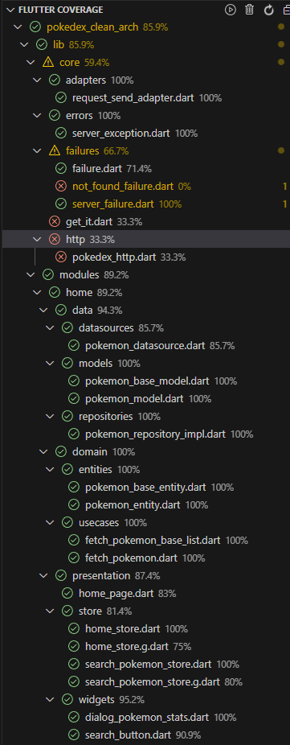

# Pokedex clean arch

Pokedex com funcionalidade de listagem e busca. Consome a https://pokeapi.co/.

# Pacotes

dio: Requisições na API   
get_it: Injeção de dependencia  
injectable: Facilitar configuração do get_it  
mobx: Gerenciador de estado  
flutter_mobx: Dependencia do mobx  
google_fonts: Fonte customizada no app  
dartz: Facilitar programação funcional para melhorar legibilidade do código  
equatable: Auxiliar na comparação de objetos  
shimmer_effect: Efeito de carregamento  

# Instalação

Instalar o APK da pasta "bin" e verificar se a funcionalidade de listagem e busca estão funcionando corretamente.

# Coverage

